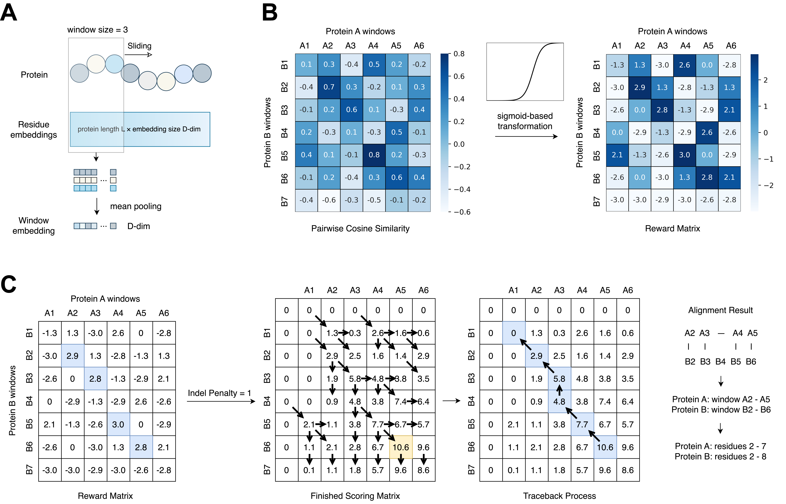

# Inferring Local Protein Structural Similarity from Sequence Alone

Read the bioRxiv [preprint](https://doi.org/10.1101/2025.11.24.690129).  

## Introduction

In this work, we developed a sequence-only framework that detects locally similar structural regions using pLM-derived embedding.

Our approach computes sliding window embeddings for two proteins, constructs a window-similarity matrix, enhances the resulting signal using a sigmoidbased transformation, and then identifies high-scoring local regions using a Smith-Waterman-style alignment procedure. This enables us to recover segments that are similar in structure, even when the full-length sequences differ substantially.

## Workflow

  - Step1: Extract window embeddings from pLM-derived residue embeddings
  - Step2: Sigmoid-based transformation for signal enhancement
  - Step3: Alignment based on the Smith-Waterman algorithm using a predefined reward matrix