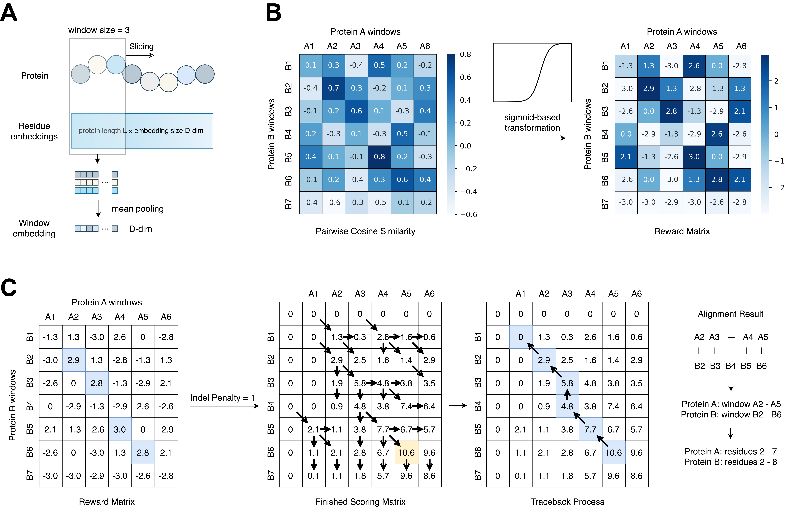

# Inferring Local Protein Structural Similarity from Sequence Alone

Read the bioRxiv [preprint](https://doi.org/10.1101/2025.11.24.690129).  


## Introduction

In this work, we developed a sequence-only framework that detects locally similar structural regions using pLM-derived embeddings.

Our approach computes sliding window embeddings for two proteins, constructs a window-similarity matrix, enhances the resulting signal using a sigmoidbased transformation, and then identifies high-scoring local regions using a Smith-Waterman-style alignment procedure. This enables us to recover segments that are similar in structure, even when the full-length sequences differ substantially.

## Workflow


  - Step 1: Extract window embeddings from pLM-derived residue embeddings
  - Step 2: Sigmoid-based transformation for signal enhancement
  - Step 3: Alignment based on the Smith-Waterman-style algorithm using a predefined reward matrix

## Setup

We recommend creating the environment from `environment.yml` before running any notebooks or reproduction scripts.

```bash
conda env create -f environment.yml
conda activate swali
```

## Repository structure

- `slidingwinalignment/` contains the core implementation of the local structural similarity framework.
- `examples/` contains example notebooks demonstrating the main applications of the tool.
- `repro/` contains notebooks and assets for reproducing the results and comparisons presented in the paper.

To get started with the tool, see:
- `examples/local_alignment.ipynb`
- `examples/motif_screening.ipynb`

For paper-related reproduction, see the notebooks and accompanying files under `repro/`.
Some large precomputed artifacts are not tracked by git and should be downloaded separately as described in the corresponding README files.